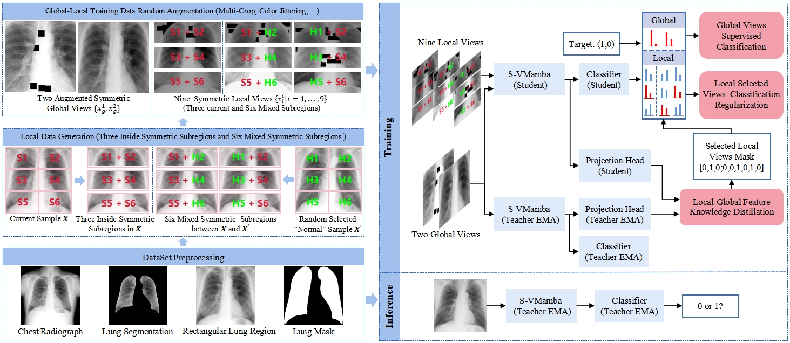
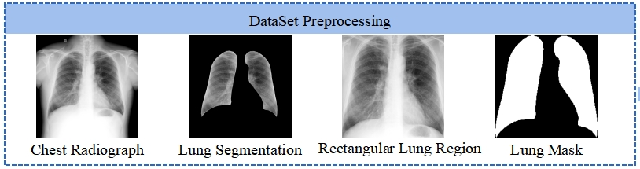

<div align="center">
<h1>SLGMS </h1>
<h3>Radiologist-Inspired Symmetric Local-Global Multi-Supervised Learning for Early Diagnosis of Pneumoconiosis</h3>

Jiarui Wang, Meiyue Song, Deng-Ping Fan, Xiaoxu Wang, Shaoting Zhang, Juntao Yang, Jiangfeng Liu, Chen Wang, Binglu Wang


</div>


## Abstract

Convolutional Neural Networks (CNNs) and Vision Transformers (ViTs) stand as the two most popular foundation models for visual representation learning. While
CNNs exhibit remarkable scalability with linear complexity w.r.t. image resolution, ViTs surpass them in fitting capabilities despite contending with quadratic
complexity. A closer inspection reveals that ViTs achieve superior visual modeling performance through the incorporation of global receptive fields and dynamic
weights. This observation motivates us to propose a novel architecture that inherits these components while enhancing computational efficiency. To this end, we draw
inspiration from the recently introduced state space model and propose the Visual State Space Model (VMamba), which achieves linear complexity without sacrificing global receptive fields. To address the encountered direction-sensitive issue, we introduce the Cross-Scan Module (CSM) to traverse the spatial domain and convert any non-causal visual image into order patch sequences. Extensive experimental results substantiate that VMamba not only demonstrates promising capabilities across various visual perception tasks, but also exhibits more pronounced advantages over established benchmarks as the image resolution increases. 

## Overview

<p align="center">
  
</p>

## Main Results

## Getting Started
### Preparation
* Install required packages:
```bash
conda create -n SLGMS python=3.9 -y
conda activate SLGMS 
conda install pytorch==1.13.0 torchvision==0.14.0 torchaudio==0.13.0 pytorch-cuda=11.6 -c pytorch -c nvidia
pip install packaging
pip install timm==0.4.12
pip install pytest chardet yacs termcolor
pip install submitit tensorboardX
pip install triton==2.0.0
pip install fvcore
pip install pandas
pip install fairscale
pip install matplotlib
pip install scikit-learn
pip install numpy==1.26.4
pip install causal_conv1d==1.1.1  # causal_conv1d-1.1.1+cu118torch1.13cxx11abiTRUE-cp39-cp39-linux_x86_64.whl can also be downloaded from https://github.com/Dao-AILab/causal-conv1d/releases/tag/v1.1.1
pip install mamba_ssm==1.0.1  # mamba_ssm-1.0.1+cu118torch1.13cxx11abiTRUE-cp39-cp39-linux_x86_64.whl can also be downloaded from https://github.com/state-spaces/mamba/releases/tag/v1.0.1
cd ../kernels/selective_scan
pip install .
```

* Download [VMamba_pretrained_pt](https://github.com/MzeroMiko/VMamba/releases/download/%23v2cls/vssm1_tiny_0230s_ckpt_epoch_264.pth).
* Preprocess the original chest radiographs by ChexMask ([paper](https://www.nature.com/articles/s41597-024-03358-1), [code](https://github.com/ngaggion/CheXmask-Database))
<p align="center">
  
</p>
*Tip.*
   - As for the Rectangular Lung Region achievement, we provide the [data_preprocessing_by_chexmask.py](data_preprocessing_by_chexmask.py). Though replace it with ['CheXmask-Database/HybridGNet/inferenceWithHybridGNet.py'](https://github.com/ngaggion/CheXmask-Database), you can get the same data preprocessing like our paper.
   
* Train
``
python classification/train_pneumoconiosis.py
python classification/train_nih.py
python classification/train_nih_Fibrosis.py
``
   - We provide the trained model weight [here](https://drive.google.com/drive/folders/1RBMk0VseBewAkhr0jwEHEAXTlgq6w1jn?usp=drive_link).

* Test
``
python classification/eval_pneumoconiosis.py
python classification/eval_nih.py
python classification/eval_nih_Fibrosis.py
``
## Acknowledgment
This project is based on VMamba ([paper](https://arxiv.org/abs/2401.10166), [code](https://github.com/MzeroMiko/VMamba)), Dino ([paper](https://openaccess.thecvf.com/content/ICCV2021/html/Caron_Emerging_Properties_in_Self-Supervised_Vision_Transformers_ICCV_2021_paper.html), [code](https://github.com/facebookresearch/dino)), Swin-Transformer ([paper](https://arxiv.org/pdf/2103.14030.pdf), [code](https://github.com/microsoft/Swin-Transformer), ChexMask ([paper](https://www.nature.com/articles/s41597-024-03358-1), [code](https://github.com/ngaggion/CheXmask-Database))), thanks for their excellent works.

